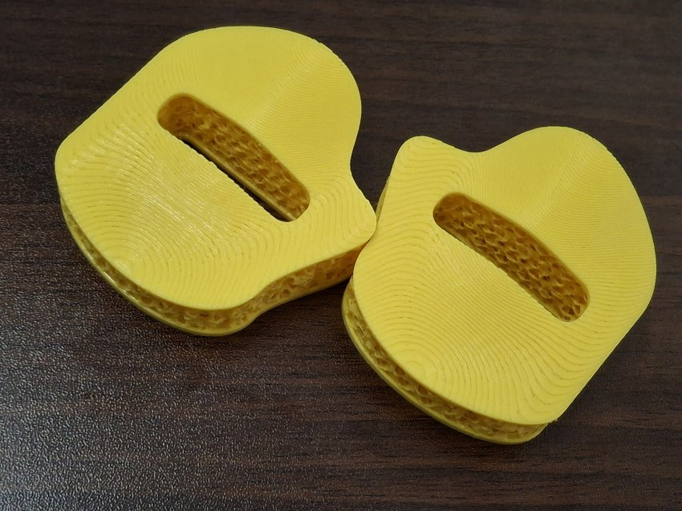
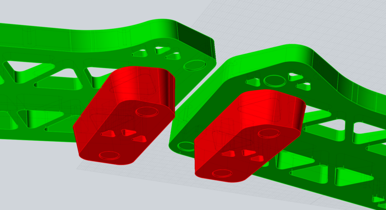

# yubuGadgets
bunch of various gadgets

all things of this repo are licenced by CC BY-SA 4.0 if without any notice

## miniPalmrest

Mini palmrest for split keyboard

## phalilwolTentingStand

Tenting Stand for [phalwol](https://github.com/yuburoll/phalwol) and [ilwol](https://github.com/yuburoll/ilwol)

## RSK - round square keycap
simple keycap in MX profile, optimized by the supports of [printyl](https://github.com/yuburoll/printyl)

## keymaps
vial keymaps for various keyboards

## keycapSpacer
spacer for MX keyswitch stems. 1mm, 1.5mm, and 2mm hights are provided with printing supports.

## yubuGadgetsFootprints.pretty
bunch of footprints which I use for keyboard design. also see external footprint license.txt to find which reference I used.
